# 企业大学排位赛需求文档
## 文档描述
修订时间|修订人|备注
---|---|---
2019-3-12|周福能|创建文档

## 1.产品概述
### 1.1产品介绍
排位赛是为企业举办竞技型比赛的活动工具，企业通过后台创建活动，员工参与活动，给出员工的活动排名；此模块前端具有创建活动、活动等级创建、规则设置、结果查看；移动端可以查看活动介绍和游戏规则、等级查看、参与者排名等。此模式和其它竞技性比赛相比具有更多的趣味性、探索性和灵活性。
### 1.2目标用户
企业管理人员、企业员工
## 2.需求分析
目前企业大学中主要是课程和考试为主，员工在里面的学习多数是任务是学习，为了完成上级交代的任务，导致学习缺少一种趣味性；为了使员工学习的同时增加趣味性，为企业提供排位赛形式的活动模式。

## 3.信息架构图
### 3.1 排位赛管理后台信息架构图
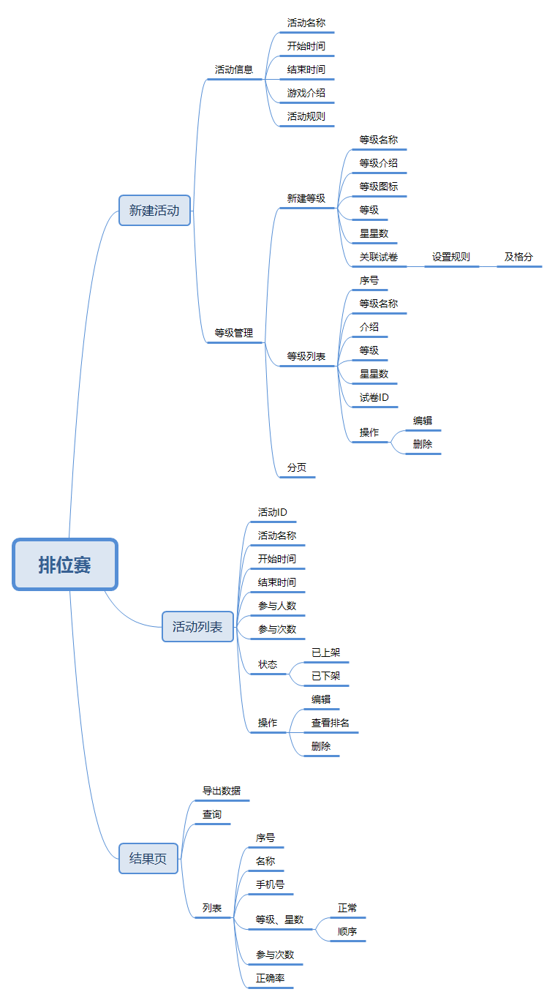
### 3.2 排位赛移动端信息架构图
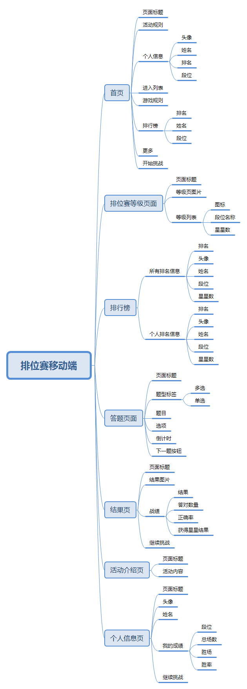

## 4.页面详细说明
### 4.1 排位赛管理后台页面说明
#### 4.1.1 排位赛列表页
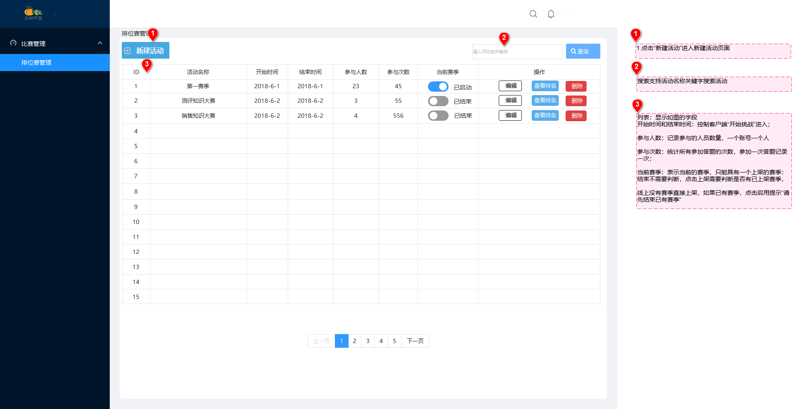

#### 4.1.2 新建排位赛页
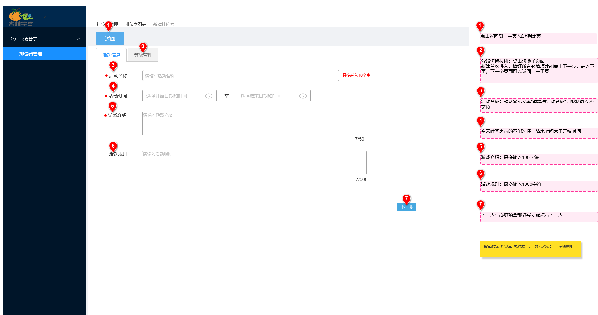

#### 4.1.3 排位赛规则设置页

#### 4.1.4 排位赛新建等级页
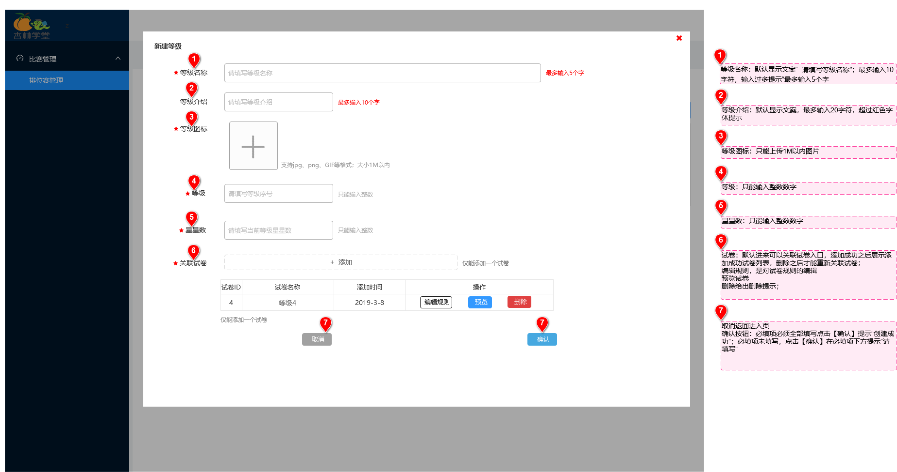

#### 4.1.5 新建等级（选择试卷）
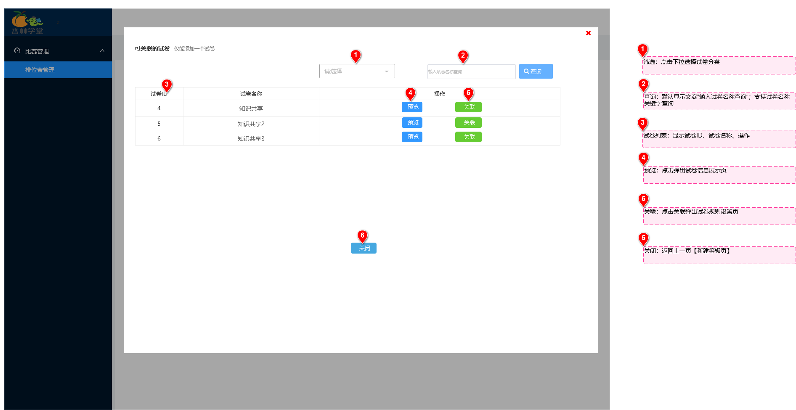

#### 4.1.6 选择试卷 (设置规则)
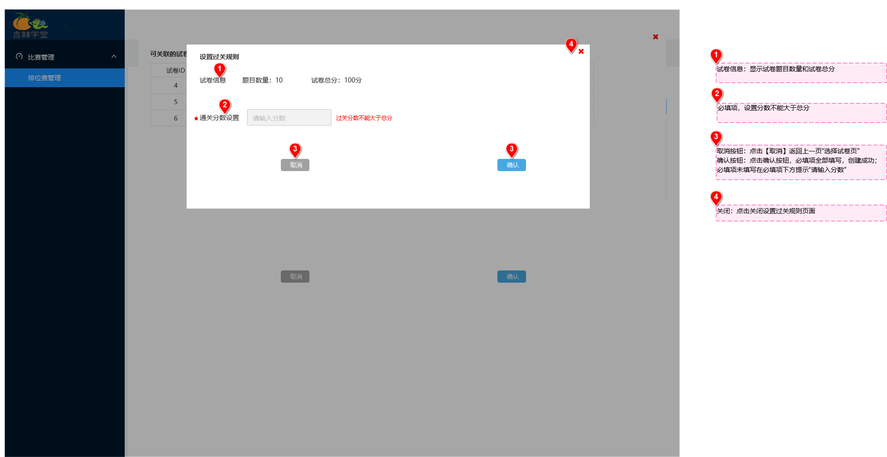

#### 4.1.7 查看排名
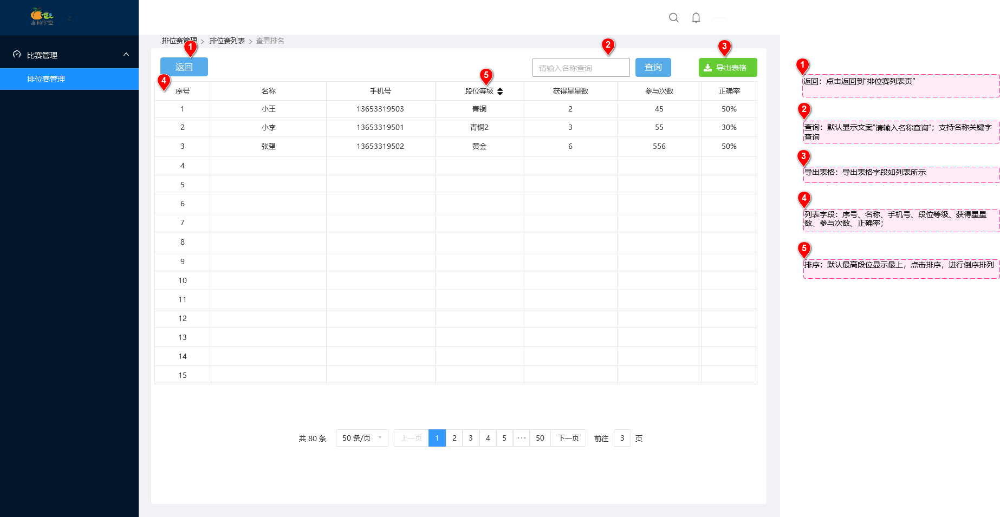

### 4.2 排位赛客户端页面说明
#### 4.2.1 排位赛首页
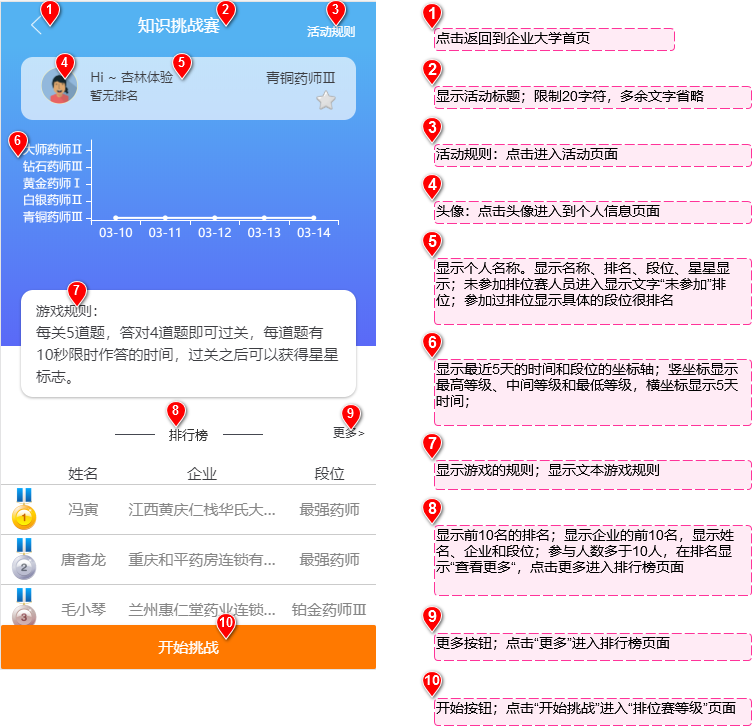

#### 4.2.2 排位赛等级列表页
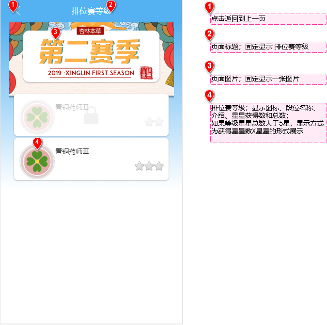

#### 4.2.3 排位赛答题页
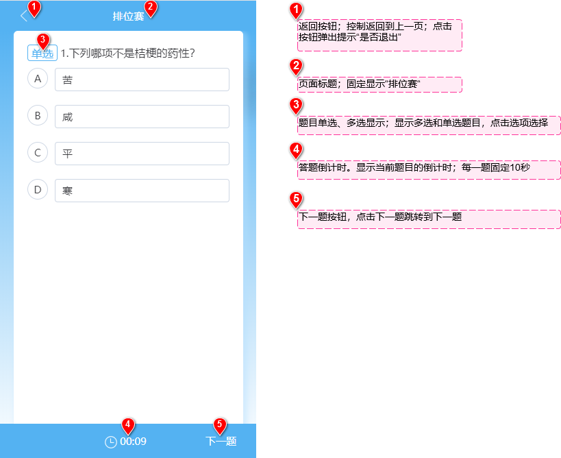

#### 4.2.4 排位赛结果页
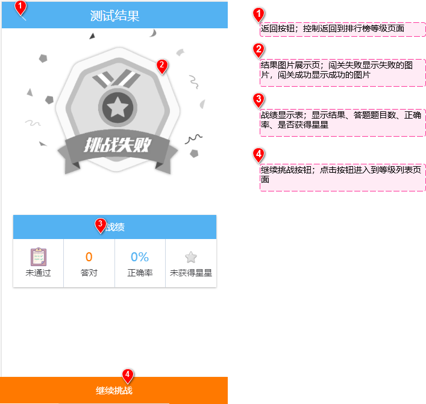

#### 4.2.5 个人信息页
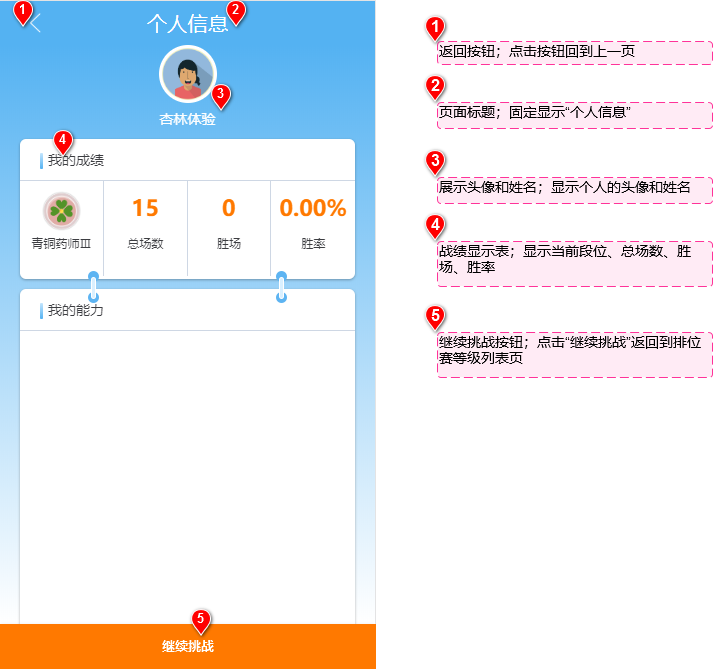

#### 4.2.6 排位赛活动介绍页
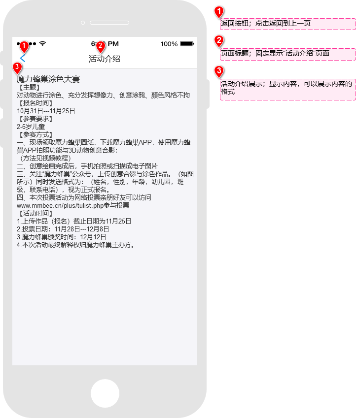

#### 4.2.7 排位赛排行榜页
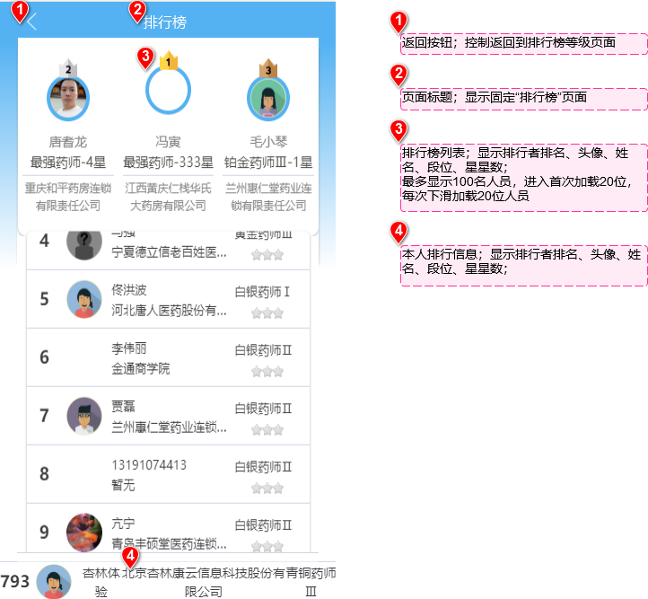